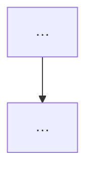

# SourceByJay — Cursor × Jay Vomit Protocol

## Permanent authority

| Role | Authority |
|------|-----------|
| **Owner (Jay)** | Final product and production authority |
| **Cursor agent** | Implementation engineer — proposes, then codes only after approval |

No agent may quietly replace an Owner decision with its own preference.

## One-line rule

> Investigate deeply, **propose before coding**, change only what was approved, prove the real user journey, and report the truth without dumping the kitchen onto the Owner's desk.

## When this skill applies

**Always** before:

- New feature or phase slice
- Database / RLS / permissions changes
- Auth or portal-boundary changes (buyer / seller / ops)
- Changing an approved user flow
- “Sort out” / redesign of screens the Owner is already using

**Skip the gate only when** the Owner says explicitly in that message: *implement now*, *just fix it*, *no proposal*, or *approved — code*.

## Before work — do not re-vomit old research

1. Read `DECISIONS.md`, `phase-state.json`, and beginner-eli5.
2. Reuse certified findings — do **not** broadly re-scout the internet when project skills already cover the area.
3. Reopen evidence only if missing, conflicting, code contradicts decisions, or high-risk assumption needs a check.

### Reference order (SourceByJay)

1. Locked decisions + current phase state  
2. Current repo code (smallest relevant scope)  
3. [sourcebyjay-reference-repos](../sourcebyjay-reference-repos/SKILL.md) + feature checklist  
4. Product UX parallels: **Alibaba first** (B2B north star), then **Amazon** / Seller Central / Business India, **IndiaMART** when India-field patterns matter  
5. **Do not invent a different UX** (e.g. full-page chat) when Alibaba already has a clear pattern (on-page Message Center panel) unless Owner explicitly asks for a different model  
6. Smallest correct proposal → **Owner approval**

### UX scout proof (mandatory — Owner 2026-08-26)

Before proposing **or** coding any **visible UI / placement / interaction** that mirrors Alibaba (or Amazon / IndiaMART):

1. **Open the real product** (Alibaba.com / help-center screenshots / Amazon as needed) — not memory, not inventing.
2. **Capture screenshot(s)** of the exact control placement (e.g. Favorites heart on image corner). Save under `.agents/skills/sourcebyjay-vomit-protocol/references/scout-shots/` when useful for the repo.
3. **Show the Owner the screenshot(s) in chat** in the same turn as the proposal (or the CHANGE fix), with a one-line caption: *what platform, what page, what we copy*.
4. State **placement in words** next to the shot (e.g. “circular heart overlay, top-right of main gallery image”).
5. If live Alibaba is captcha-blocked, use **official Alibaba Help Center screenshots** for that feature — still show the image; do not guess.

Skipping screenshots = inventing. That is a process defect. Do not make the Owner correct placement ten times.

### Retrospective scout before advancing a phase (mandatory — Owner 2026-08-26)

When the Owner says **next** / **GO** after a phase, **do not** jump to the next phase’s feature work until:

1. **Scout what we already shipped** vs Alibaba (screenshots of *ours* + *theirs* for the same screen type).
2. Write a short **gap list**: blocker / should-fix / later-ok. Save under `references/` (see [AUDIT-PHASES-0-7.md](references/AUDIT-PHASES-0-7.md)).
3. Show the Owner the shots + gaps in chat.
4. **STOP** for **APPROVE catch-up** / **SKIP catch-up** / **CHANGE**.

Phases can be marked visually OK for a demo and still have **skipped workflows** (dead loops, stub portals). Catch-up is not optional unless Owner explicitly **SKIP**.

Latest full audit: [AUDIT-PHASES-0-7.md](references/AUDIT-PHASES-0-7.md).

## Form fields gate (mandatory for every form)

Before proposing or building **any** signup, profile, onboarding, listing, or KYC form, include a **Field matrix** in the proposal:

| Field | Amazon Business / B2B India | Amazon Seller Central | IndiaMART | Alibaba | SourceByJay decision | Required? |
|-------|----------------------------|------------------------|-----------|---------|----------------------|-----------|
| … | have / skip / later | … | … | … | keep / drop / later | yes / no |

Rules:

- **Buyer signup** and **Seller apply** are different forms — never mix seller KYC into the buyer account page.
- Prefer **phone (India mobile + OTP later)** and **business email** where those platforms treat them as load-bearing.
- Do not ask for bank/PAN/GST on day-1 buyer signup; do require them (or mark “later step”) for seller apply when India platforms do.
- **Buyer and seller are separate profiles** — never “become a seller” by mutating the buyer profile in place. Linking accounts is a later optional admin/analytics feature only.
- If a field is not important on ≥2 of those platforms for that persona, default to **drop** or **later** unless Owner overrides.
- Seller signup is its **own** registration on the vendor portal (own email/phone identity), not a side form on the buyer account page.
- Plan for **ops-toggleable form fields** (admin can turn fields required/optional/hidden) so product can change without code every time.

## Pre-implementation approval gate (mandatory)

Present a compact proposal, then **STOP**.

### Proposal template

```markdown
## Proposal — [feature name]

### What
[1–3 sentences]

### Why
[User pain / bug / phase requirement]

### How the big platforms do it
| Platform | Pattern | Steal / skip |
|----------|---------|--------------|
| Amazon | … | … |
| Alibaba | … | … |
| IndiaMART (if relevant) | … | … |

### OSS / repo scout (this task)
| Reference | What we steal | What we skip |
|-----------|---------------|--------------|
| Mercur / Medusa / Refine / Nextbase / … | … | … |

### Common-sense check
[Why this is NOT wrong for SourceByJay — or call out a risk]

### Field matrix (required if any form changes)
| Field | Amazon Biz/B2B IN | Amazon Seller Central | IndiaMART | Alibaba | Our decision | Required? |
|-------|-------------------|------------------------|-----------|---------|--------------|-----------|
| … | … | … | … | … | keep/drop/later | yes/no |

### BEFORE flow (Mermaid)


### AFTER flow (Mermaid)


### ELI5 user journeys
**Buyer:** …
**Seller:** …
**Ops (if touched):** …

### Files / DB / permissions affected
- …

### Risks & security
- …

### Test plan (Owner can click)
1. …

### Owner decision
Reply **APPROVE** to implement, **CHANGE: …** to revise, or **HOLD**.
```

Do **not** start coding, migrations, or “quick fixes” in the same turn as the first proposal unless the Owner already approved.

## During implementation (after APPROVE)

- Stay inside approved scope.
- Reuse canonical systems — no duplicate portals/auth/CMS.
- If the real fix must change the plan materially → **STOP** and re-propose.
- Test happy path **and** denied path (buyer cannot use seller CMS; non-staff cannot use ops).

## After work — compact vomit report

```markdown
## Goal
## Before
## After
## Changes Made
## Reused Logic
## Proof and Tests
## Defects / Blockers
## Owner Decision Needed
```

### Do not include

Raw search dumps, full terminal logs, every file inspected, unchanged code, repeated history, green checkmarks without evidence.

## Visual / ELI5

Prefer Mermaid for flows. Anchor to real SourceByJay URLs/apps (`:3000` buyer, `:3001` vendor, `:3002` ops). Pair with [beginner-eli5](../sourcebyjay-beginner-eli5/SKILL.md) for any manual steps.

## Relation to other skills

| Skill | Role |
|-------|------|
| beginner-eli5 | How to talk to the Owner |
| vomit-protocol | **When** you may code; proposal + report shape |
| phase-tracker | Phase GO/HOLD/CHANGE |
| reference-repos | Mandatory OSS name before features |
| visual-demo | End-of-phase screenshots |

Vomit Protocol **gates implementation**. Phase-tracker **gates phase advance**. Both require Owner words.
