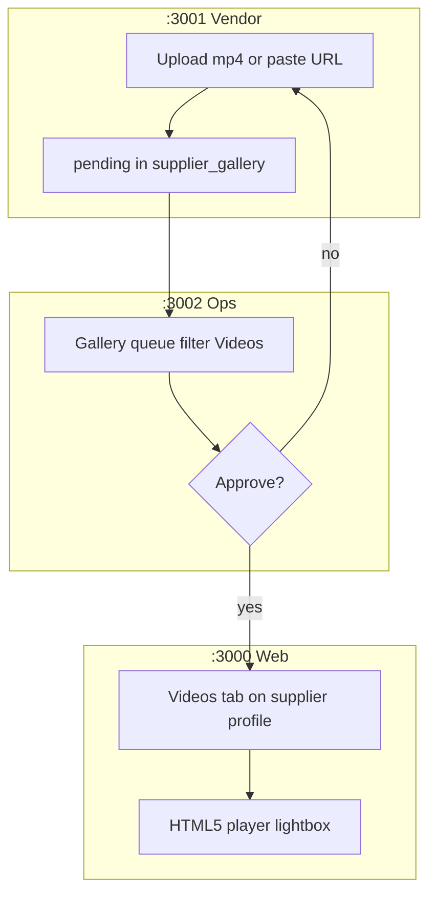

# Scout — Phase 14 Video media (factory tours + product clips)

**Date:** 2026-08-29  
**Status:** Reference complete — awaiting Owner **APPROVE** before code  
**Prior proposal gap:** First Phase 14 sketch lacked platform matrix, OSS gate, India parallel, and gap audit vs repo.

---

## 1. Platform scout matrix

| Dimension | Alibaba.com | IndiaMART | SourceByJay MVP (Phase 14) |
|-----------|-------------|-----------|----------------------------|
| **Where video lives** | Company profile **Videos** section; product listings can have play-button on image; inspection reports may link factory media | **Product-level** video URL on catalog row (Manage Products → below image) | **Supplier profile Videos tab** + optional **product video URL** (Slice B) |
| **Video types** | Factory tour, R&D, team intro, QC walkthrough; verified suppliers may have partner-shot on-site video | Product demo / usage clips; catalog trust | Factory floor tour, warehouse, production line (primary); product demo (secondary) |
| **Upload model** | Supplier uploads to storefront; Alibaba moderation | URL paste or Android upload to product | File upload to Supabase Storage **or** external URL (YouTube/Vimeo/mp4 link) |
| **Moderation** | Platform review before prominent placement | Catalog guidelines | **Ops approve/reject** (same as Phase 1 gallery) |
| **Buyer discovery** | Company card → storefront → Videos; product PDP play icon | Search/catalog cards with video badge | `/suppliers/[slug]` **Videos** tab; Phase 18 factory mini-site reuses player |
| **Plan gating** | Premium / Verified programs get richer media | Maximiser Pro tier | **`video_tab: true`** on Business+ plan JSON (already seeded, not wired) |
| **Live / VR** | Live video call, VR showroom (premium) | “Request video meet” with AM | **Out of scope** — defer post go-live |
| **Transcoding** | Alibaba CDN + internal pipeline | Hosted URL | **MVP:** Supabase Storage; **Later:** Cloudflare Stream/R2 blobs + Supabase metadata only |

### Primary URLs scouted

- Alibaba verified supplier + factory video: [reads.alibaba.com — How suppliers are verified](https://reads.alibaba.com/how-are-alibaba-com-suppliers-verified/) (on-site video tour commissioned by verification partners)
- Alibaba buyer guide — company profile videos: [Shopify Alibaba 101](https://www.shopify.com/ae/blog/16665772-alibaba-101-how-to-safely-source-products-from-the-worlds-biggest-supplier-directory) (Videos, VR, 360 in Company Profile)
- IndiaMART product video: [help.indiamart.com — add product videos](https://help.indiamart.com/knowledge-base/add-product-videos/) (URL below product image)
- IndiaMART catalog video gallery: [help.indiamart.com — Manage Catalog](https://help.indiamart.com/manage-catalog/) (upload via Android, product score impact)
- Mux + Supabase: [Mux Supabase integration](https://www.mux.com/docs/integrations/supabase) · [Next.js guide](https://www.mux.com/docs/frameworks/next-js)

---

## 2. Alibaba UX placement (what we copy)

| Surface | Alibaba pattern | SourceByJay placement |
|---------|-----------------|----------------------|
| Supplier storefront | Dedicated **Videos** area on company profile (alongside About, Products, Certifications) | New **Videos** tab on `SupplierProfile.tsx` — separate from **Factory tour** photo carousel |
| Factory tour photos | Gallery / VR / 360 in Company Profile | Keep existing **Factory tour** tab (photos only) — do not mix video into photo carousel |
| Product PDP | Small **play icon** on main image when product has video | **Slice B (optional):** play overlay on product gallery if `products.video_url` set |
| Verified supplier | Third-party inspection video linked from profile | Future: link ops-uploaded inspection PDF/video — **not Phase 14** |
| Trust signal | Clear, well-lit factory floor; recent footage | Ops rejection reason: “unclear / not factory / copyrighted” |

**Phase 18 dependency:** Factory mini-site spec says “VR / 360 factory tour → Phase 14 video + future”. Phase 14 delivers **recorded mp4 tours**, not 360.

---

## 3. OSS / repo scout (mandatory gate)

| Priority | Repo / doc | What we **steal** | What we **skip** |
|----------|------------|-------------------|------------------|
| **Primary (MVP)** | **This repo** Phase 1 `supplier_gallery` + ops review | Pending → approved flow, RLS, audit | Image-only `image_url` column |
| **Primary (MVP)** | **This repo** Phase 13 ad studio `<video>` | HTML5 playback of Storage/public URL | Ad billing |
| **Secondary** | [Mux Next.js docs](https://www.mux.com/docs/frameworks/next-js) | Direct Upload URL + webhook → asset status; Mux Player | Full Mux in MVP (needs account + cost) |
| **Secondary** | [Mux + Supabase](https://www.mux.com/docs/integrations/supabase) | `mux_assets` schema + webhook edge function pattern | Semantic search / embeddings (overkill) |
| **UX only** | Alibaba company profile | Videos tab + factory tour separation | VR showroom |
| **UX only** | IndiaMART | Product video URL field below images | Their seller panel layout |
| **Same-stack** | Supabase Storage policies | Extend `supplier-media` bucket mime types | New bucket unless size limits force it |

**Recommendation:** **Phase 14A = Supabase Storage + HTML5 video** (no new vendor, no Stripe-style billing). **Phase 14B (optional post-MVP)** = Mux for transcoding, adaptive bitrate, view analytics.

**Why not Mux day one:** Owner locked fake/test modes elsewhere; Mux adds API keys, webhook infra, and per-minute cost before go-live. ALIBABA-INDIA-MVP lists “Mux” as reference, not requirement.

---

## 4. Gap audit — our repo today

| Area | Today | Phase 14 gap |
|------|-------|--------------|
| `supplier_gallery` table | `image_url` only; `gallery_media_type` = factory/showroom/… | Add `content_kind` (`image` \| `video`) + `video_url` OR unify as `media_url` |
| Storage `supplier-media` | Images only, 10MB | Add `video/mp4`, `video/webm`; raise limit ~50MB for clips |
| `SupplierProfile.tsx` | **Factory tour** tab = photo carousel | Add **Videos** tab with player grid |
| Vendor `/gallery` | Photo upload form only | Photo / Video toggle; URL paste fallback |
| Ops gallery review | Approve photos | Filter Photos \| Videos; video thumbnail + inline preview |
| `listing_plans.features.video_tab` | Business plan JSON flag | Gate Videos tab visibility (show tab for Business+ OR any supplier with approved videos) |
| Product PDP | No product video | **Optional Slice B:** `products.video_url` |
| Phase 18 mini-site | Factory tour = gallery grid | Reuse `SupplierVideoGrid` component |

---

## 5. Proposed scope (revised after scout)

### Phase 14A — MVP (recommended for APPROVE)

| Slice | Deliverable |
|-------|-------------|
| **A1 Schema** | `content_kind`, `video_url` on `supplier_gallery`; storage mime + size; migration via diff |
| **A2 Seller** | Vendor gallery: upload mp4/webm **or** paste URL; max N videos by plan (`video_slots: 3` Business, `1` Pro, `0` Free) |
| **A3 Buyer** | **Videos** tab on supplier profile; grid + lightbox player; empty state for Free tier |
| **A4 Ops** | Gallery queue: type filter, approve/reject video, audit log |
| **A5 Plan gate** | Read `video_tab` / slot count from `vendor_subscriptions` → listing_plans.features |

### Phase 14B — Stretch (separate APPROVE)

| Slice | Deliverable |
|-------|-------------|
| **B1 Product video** | `products.video_url` — IndiaMART-style URL on listing edit + PDP play badge |
| **B2 Mux** | Direct upload, webhook, Mux Player, processing status |

### Explicitly out of scope

- Livestream, 360° VR, video calls in chat
- Auto transcription / semantic video search
- Video ads (Phase 13 handles ad creatives separately)

---

## 6. Data model proposal

```sql
-- Extend supplier_gallery (preferred over new table — reuse ops queue)
ALTER ... ADD content_kind text NOT NULL DEFAULT 'image'
  CHECK (content_kind IN ('image', 'video'));
ALTER ... ADD video_url text; -- populated when content_kind = 'video'
-- image_url stays for images; for video optional poster/thumbnail frame URL

-- Optional Phase 14B
ALTER products ADD video_url text;
```

**Moderation:** Same `media_review_status` enum (`pending` → `approved` → public).

---

## 7. User journeys (Mermaid)



---

## 8. Visual demo acceptance (Phase 14)

| # | Check |
|---|-------|
| 1 | Business seller uploads 30s factory clip → pending |
| 2 | Ops approves → clip visible on **Videos** tab (not mixed into photo carousel) |
| 3 | Free seller sees upsell or upload blocked at slot limit |
| 4 | Mobile 375px: video grid readable, play works |
| 5 | Rejected video never appears publicly |

---

## 9. Risks & mitigations

| Risk | Mitigation |
|------|------------|
| Large files slow upload | 50MB cap; recommend ≤2 min 720p in UI copy |
| Copyright / junk uploads | Ops moderation required (same as photos) |
| Safari autoplay | No autoplay on grid; play in lightbox on tap |
| Storage cost at scale | Mux migration path documented in 14B |

---

## 10. Owner decision

| Option | Meaning |
|--------|---------|
| **APPROVE 14A** | Build MVP slices A1–A5 (Storage + Videos tab + ops) |
| **APPROVE 14A+B** | Also product video URL on listings |
| **CHANGE** | e.g. Mux only, combined Factory tab, no plan gate |
| **DEFER Mux** | Default — 14B later |

---

## 11. Owner decision (2026-08-29)

**APPROVED — full scope (14A + product video):**

- Company **Videos** tab (Alibaba) — separate from Factory photo tour
- **Product-level video** with seller **toggle** (IndiaMART-style) — Pro+ plan
- Plan gates: Pro = product video only; Business+ = factory video slots + Videos tab
- Ops moderation for all factory videos; product video self-serve when plan allows
